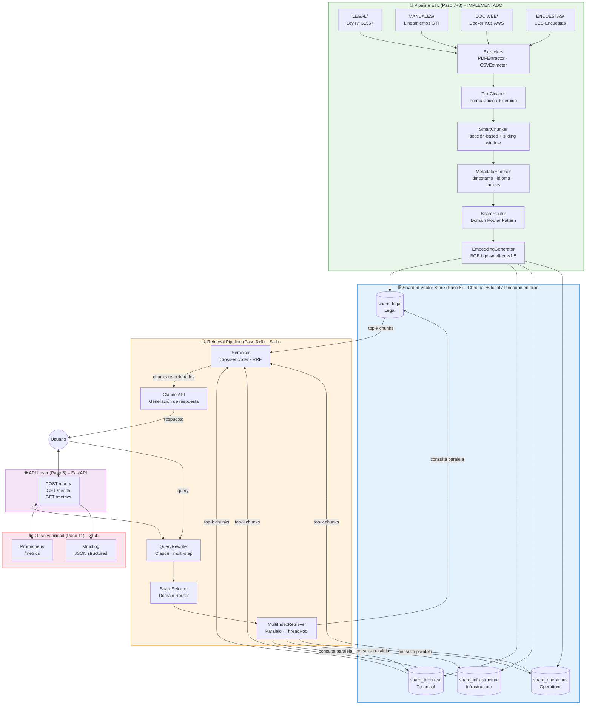
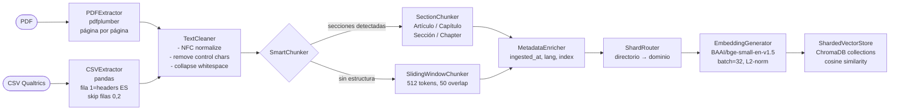
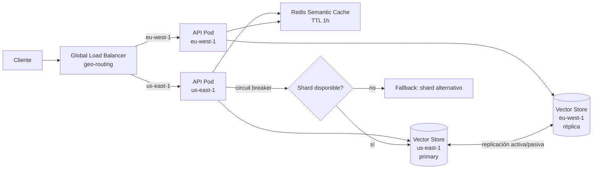

# Arquitectura Distribuida RAG con Sharding
## Proyecto 9 – Distributed RAG Architecture (Sharded Vector Stores)

---

## Paso 3 – Patrón de Diseño LLM

### Patrones implementados

| Patrón | Estado | Archivo |
|--------|--------|---------|
| **Sharded Retrieval Pattern** (obligatorio) | Implementado (ETL) | `src/etl/loaders/shard_router.py` |
| **Multi-Index Retrieval Pattern** | Stub conectado | `src/retrieval/multi_index_retriever.py` |
| **Domain Router Pattern** | Implementado | `src/retrieval/shard_selector.py` |
| **Query Rewriting Pattern** | Stub | `src/retrieval/query_rewriter.py` |
| **Reranking Pattern** | Stub (RRF implementado) | `src/retrieval/reranker.py` |
| **Retrieval Cascade Pattern** | En ShardSelector (broadcast) | `src/retrieval/shard_selector.py` |

---

## Paso 6 – Diagrama de Arquitectura Completa Distribuida



---

## Paso 7 – Diseño del Pipeline de Ingesta + Sharding

### Flujo por tipo de documento



### Criterio de Sharding (Paso 7 – obligatorio)

| Directorio fuente | Dominio | Shard ChromaDB | Tipo de chunking |
|-------------------|---------|----------------|------------------|
| `LEGAL/` | legal | `shard_legal` | Section (Artículo/Título) |
| `MANUALES/` | technical | `shard_technical` | Section + Sliding fallback |
| `DOC WEB/` | infrastructure | `shard_infrastructure` | Section (Chapter) + Sliding |
| `ENCUESTAS/` | operations | `shard_operations` | Sliding (20 rows/chunk) |

---

## Paso 8 – Embeddings y Vector Storage

### Modelo seleccionado: BAAI/bge-small-en-v1.5

| Criterio | Valor |
|----------|-------|
| Dimensiones | 384 |
| Costo inferencia | $0 (local) |
| Latencia por batch de 32 | ~50ms CPU / ~5ms GPU |
| Recall MTEB (avg) | 0.621 |
| Normalización | L2 → cosine similarity |

### Migración a producción (Paso 2 – infraestructura)

```
Dev:  ChromaDB local (PersistentClient)
      ↓ cambiar VECTOR_BACKEND=pinecone en .env
Prod: Pinecone (multi-index = un índice por shard)
      ↓ Paso 10: replicación multi-región
Geo:  Pinecone pods en us-east-1 (primary) + eu-west-1 (réplica)
```

---

## Paso 10 – Optimización Multi-Región y Alta Disponibilidad

### Topología de replicación



### TODOs Paso 10
- [ ] Configurar replicación activa/pasiva en Pinecone (primary → réplica)
- [ ] Implementar geo-balancing en Route53 / Cloud DNS
- [ ] Circuit breaker: si shard no responde en 500ms → fallback a otro shard
- [ ] Semantic caching: Redis con hash de embedding como key, TTL 3600s
- [ ] Calcular latencia cross-region: us-east-1 → eu-west-1 (~75ms RTT)

---

## Paso 1 – KPIs por Dominio

| KPI | Legal | Technical | Infrastructure | Operations |
|-----|-------|-----------|----------------|------------|
| Retrieval Accuracy target | 95% | 90% | 85% | 88% |
| Latencia p99 (ms) | 2000 | 1500 | 1500 | 500 |
| Reranking Quality min | 0.85 | 0.80 | 0.75 | 0.78 |
| Shard Selection Accuracy | > 98% | > 95% | > 92% | > 90% |

---

## Trade-offs técnicos (Paso 3)

| Decisión | Alternativa | Trade-off |
|----------|-------------|-----------|
| BGE-small (384d) local | Azure OpenAI ada-002 (1536d) | Menor calidad vs costo $0 y sin latencia de red |
| ChromaDB (dev) → Pinecone (prod) | Qdrant Distributed | Pinecone managed + multi-index nativo; Qdrant más flexible en self-hosted |
| SectionChunker primero | Solo SlidingWindow | Mejor coherencia semántica; riesgo de secciones muy largas (mitigado con split) |
| Serverless (Cloud Run) | Kubernetes | Cloud Run: zero cold-start en prod; K8s: más control GPU para reranker |
